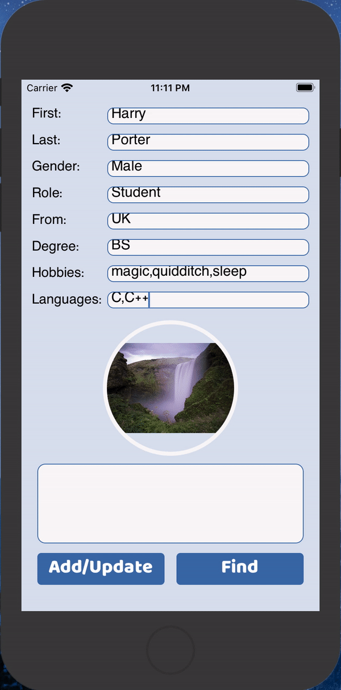
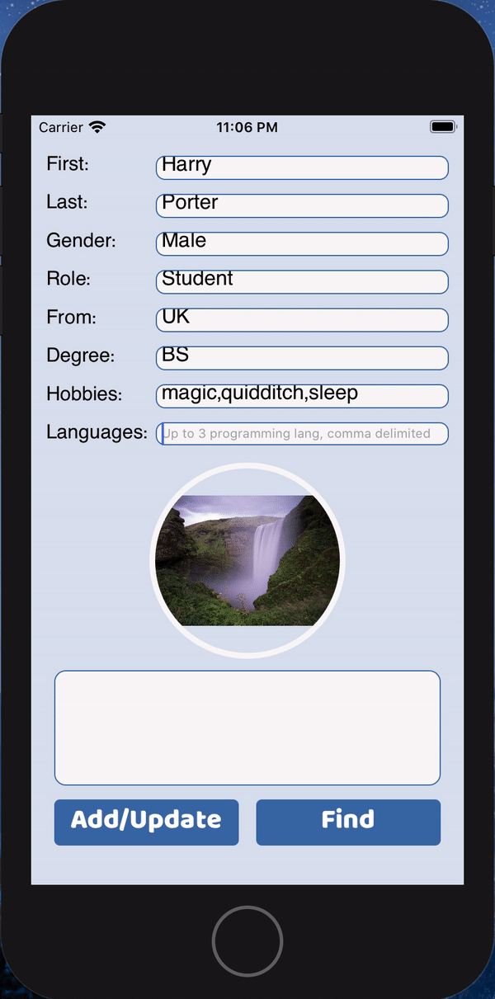
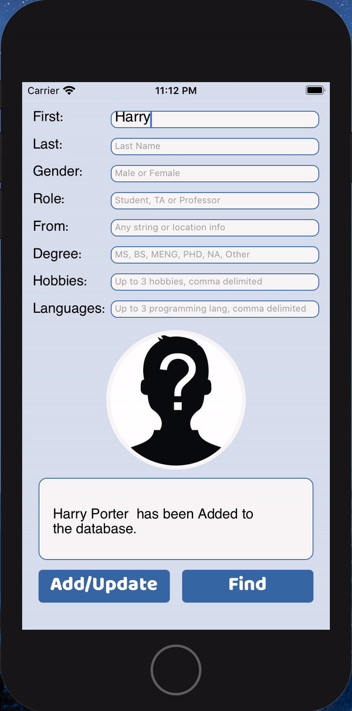
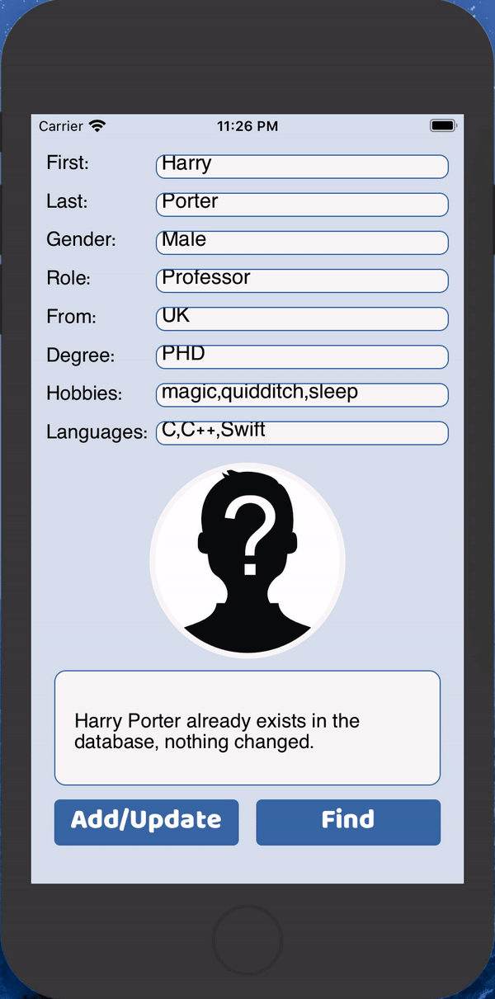
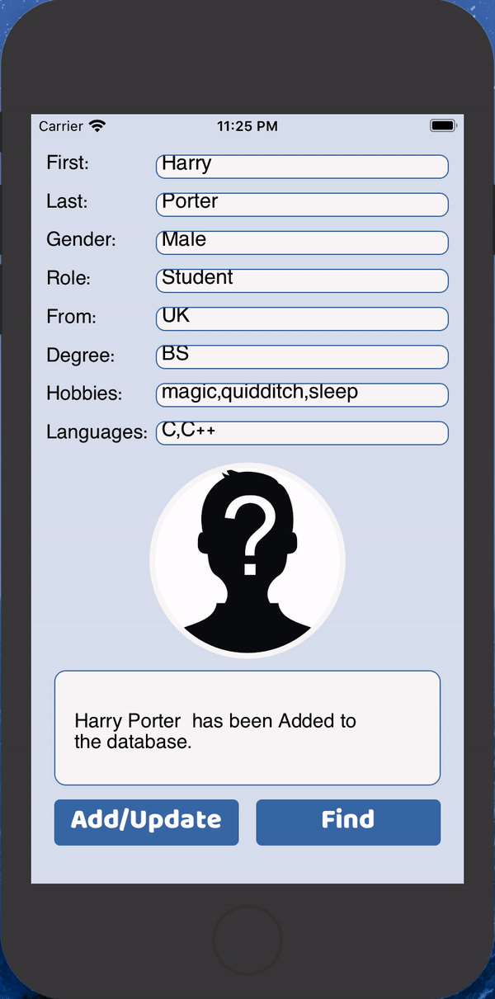
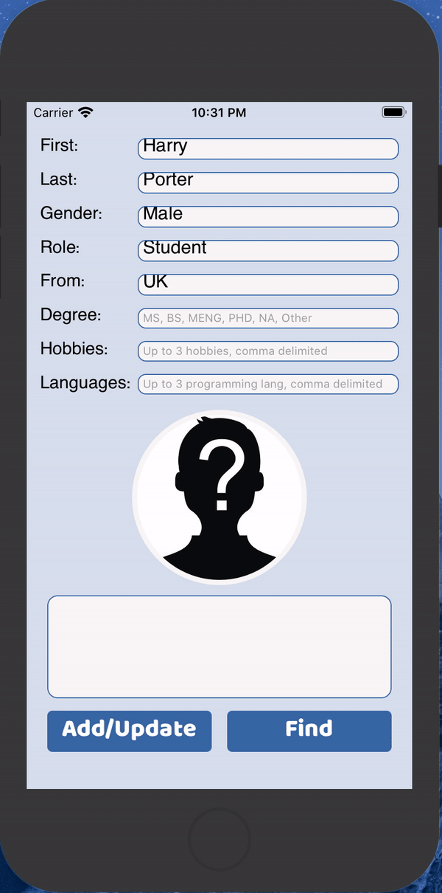
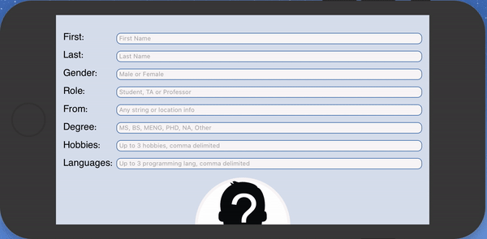

# ECE564 HW2 DukePerson App Test Document

- !!! Important Note: DukePerson app has camera function. If you want to test camera please run on real device! And please change signing before run it!


## **Basic Functions**

### **1. Add new person**
- Step1: Complete all items on the form for new person: **"Harry Porter"**, as is shown in snapshot below.

```
    First: Harry
    Last: Porter
    Gender: Male
    Role: Student
    From: UK
    Degree: BS
    Hobbies: magic,quidditch,sleep
    Languages: C,C++
```
- Step2: Click **"Add/Update"** button, status message shows **"Harry Porter has been Added to the database."**
- Error handling 1: If user left some items empty when click "Add/Update" button, error message will be, for example, **"Please fill in \"First:\" before add/update."**
- Error handling 2: If user inputs more than 3 hobbies or languages, error message will be: **"Languages: Up to 3 languages."**
- Error handling 3: It is ok if new person do not select or take a photo, DukePerson App will **give him/her a default photo according to gender**.

<div align=center>

</div>


### **2. Find person**
- Step1: Fill in like **"First: Harry"** or **"First: Harry, Last: Porter"** or **"Last: Porter"**.
- Step2: Click **"Find"** button, display the information: **"Harry Porter is from UK and is a student. He is proficient in C, C++. When not in class, Harry enjoys magic,quidditch,sleep"** and his photo which is saved before.
- Note: Of course you can search "Ric", "Jingru", "Haohong" and "Nan" for fun.
- Error handling 1: If there's no such person, give an error message: **"Person not found."** and photo with question mark face.
- Error handling 2: If there's no input in "First:" and "Last:" field, give an error message: **"Please enter first name and/or last name."**
- Error handling 3: If user inputs wrong name format, give an error message: **"Please enter first name and last name by one word."**

<div align=center></div>


### **3. Update person**
- Step1: Complete all items on the form for "Harry Porter", make some changes eg. change the degree from "BS" to "MS"
- Step2: Click **"Add/Update"** button, status message shows **"Harry Porter has been Updated in the database."**
- Error handling 1: If nothing was changed to "Harry Porter", give an message: **"Harry Porter already exists in the database, nothing changed."**

<div align=center>

</div>


## **Additional Functions**

### **1. Picker control**
- Implement elegent picker control for Gender, Role and Degree. Use controls other than Text Field and Label.
- Detail 1: The picker will roll back to the first line after resetting the form.

<div align=center></div>

### **2. Take photo or choose photo from album**
- Put picture in the entry in the Data Model. 
- User can take photo or choose photo from album and save it with other information.
- The saved photo will be displayed if the person is found.
- Pictures of professor, TA and nn75 are already added in Assets and cannot be changed.
- **If the user forgot to put in a photo, app will give him/her a default photo according to gender, a man photo to male and a woman photo for female.**
- Error handling 1: If the device or simulater does not support camera or album function, give an backend error message.


### **3. Nicer looking layout**
- Use UIScrollView and constraints to make layout fit every orientation of iPhone perfectly.
- The user interface is well designed, eg. the buttons at the bottom is more convenient for users to click.
- Use the blue theme to make app more in line with Duke style.

<div align=center></div>

### **4. Use of color, style**
- Add custom color sets in Assest.
- Add custom font named "BalooBhaina-Regular" and use it on buttons.
- Put the name of colors and style in Constants.swift for easy use.

<div align=center></div>

### **5. Tighter code**
- Clever ways to make the code less verbose. DukePerson can have a lot of repetitive code but I make it more concise.
- For example, pass in an arrray of string to name UILabels, and create and return a array of UILabel elements.
```swift
    func createLabelArray(named: [String]) -> [UILabel] {
        return named.map {name in
            let label  = UILabel()
            label.translatesAutoresizingMaskIntoConstraints = false
            label.text = "\(name)"
            label.font = UIFont(name: "ArialHebrew", size: 17)
            label.textAlignment = .left
            return label
        }
    }
```

### **6. Extensive Error Checking**
- **There are 8 kinds of error handlings in total listed above.**
