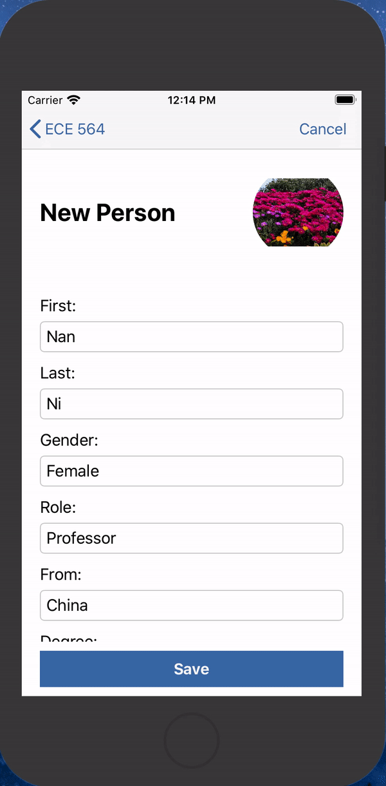
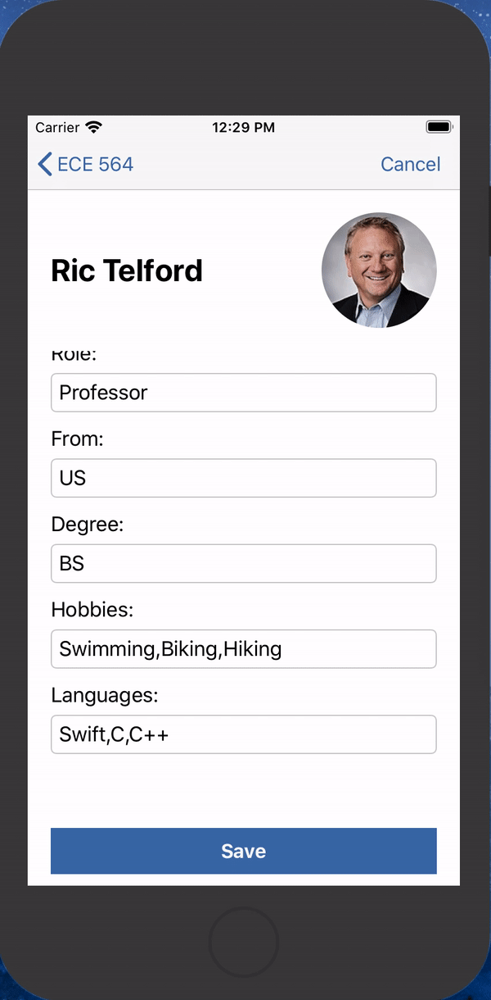

# ECE564 HW3 DukePerson App Test Document

## **Basic Functions**

### **1. Add new person**
- Step1: Press **“+”** button on the Navigation Bar, present **Information View** to add a new person to the class.

```
    Click on the "man with question face" to get a photo by album or camera
    First: Harry
    Last: Porter
    Gender: Male
    Role: Student
    From: UK
    Degree: BS
    Hobbies: magic,quidditch,sleep
    Languages: C,C++
    Team: Gryffindor
```
- Step2: Click **"Save"** button, if saved successfully, it will go back to **Table View** and **"Harry Porter"** is under the new section -- **Gryffindor**.
- Step3: Press **“+”** button again, and then press the **"Cancel"** button on **Information View**, it will go back to **Table View** with nothing changed.
- Error handling 1: If the full name of a new person matches someone already in the class when pressing save button,  pop up an alert: **"Save failed: Nan Ni already in the class!"**
- Error handling 2: If user inputs more than 3 hobbies or languages, error message will be: **"Save failed: Languages: Up to 3 languages!"**
- Error handling 3: If any text field left blank, pop up an alert: **"Save failed: All fields are required!"**

<div align=center>


</div>


### **2. Edit person**
- Step1: Click the cell of Nan Ni on **Table View**, navigate to **Information View** which is filled with Nan's information, the text is gray and cannot be edited.
- Step2: Click the **"Edit"** button on the right corner of the **Information View**, the text turns to black and can be edited, the button becomes a **"Edit"** and a save button appears.
- Step3: Because Nan does not have a team now, her **"Team:"** field is empty, and set it to **Gryffindor** as well.
- Step4: You can change other fields of Nan, like the image, the hobbies, etc. (But not change role to Professor or TA)
- Step5: Click save and return back to **Table View**, Nan Ni is now in **Gryffindor** team and other fields are updated on **Table View**.
- Error handling: The same as adding person.

<div align=center>

</div>


## **Additional Functions**

### **1. Add Team**
- In the steps of basic function, I already add a new person to new team and move a student from **"Student"** section to **"Team"** section by editing the team text field.
- Detail1: You can also move the student in the **"Team"** section back to **"Student"** section.
- Detail2: If user choose **"Professor"** or **"TA"** for the role, the team text field will be hidden.
- Detail3: If all the student in the team go to other sections (which means there's an empty team), the title of this team will disappear after next **"Save"** or **"Cancel"** operation.


### **2. Collapsable Section -- Clever code**
- The sections in **Table View** are collapsable.
- The header of section is well designed in **CollapsibleTableViewHeader** class.
- I create a class named **"DukePersonSection"** to put attributes of the section together:
```swift
struct DukePersonSection {
    var name: String               //Name of the section: Professor, TA, Student, and other team names
    var dukePersons: [DukePerson]  //Person in the section
    var collapsed: Bool            //Indicate whether the section is collased.
}
```
<div align=center></div>


### **3. Add Swipe Actions To Table Cell**
- For friendly user experience.
- The user can swipe left to choose whether edit or delete the person.

<div align=center></div> 


### **4. Add Camera / Photo Roll support**
- Put picture in the entry in the Data Model. 
- User can take photo or choose photo from album and save/update it with other information.
- The photo will be displayed in both **Table View** and **Information View**.
- Pictures of professor, TA and Nan Ni have default photos in Assets and user can input a new photo for them.
- **If the user forgot to put in a photo, app will give him/her a default photo according to gender, a man photo to male and a woman photo for female.**
- Error handling 1: If the device or simulater does not support camera or album function, give an backend error message.
- Error handling 2: If the user does not input a photo, the app gives the "man in question" picture to the person as default.


### **5. Creativeness in the design Table View and Cells**
- Design my cell in .xib file and register it to **Table View**
- Elegant cell has well-shaped photo, eye-catching name tag and professional Bio.


### **6. Advanced Picker control**
- In the hw2 I already implemented picker control for Gender, Role and Degree. In the hw3, I make it more user-friendly.
- Improvement1: If the text field is blank (when adding a new person), make the first option in the selection wheel as the default input.
- Improvement2: If the text field has an option (when editing a person already exists), make the selection wheel row to the same option.

<div align=center>

</div>

### **7. Dismiss keyboard**
- User can tap anywhere on the view controller to dismiss the keyboard.


### **8. Nicer looking layout**
- Use UIScrollView and constraints to make layout fit every orientation of iPhone perfectly.
- The user interface is well designed, eg. the buttons at the bottom is more convenient for users to click.
- Add custom color sets in Assest, the blue theme makes app more in line with Duke style.

<div align=center></div>


### **9. Extensive Error Checking**
- **The 8 kinds of error handling of previous assignments has been retained.**
