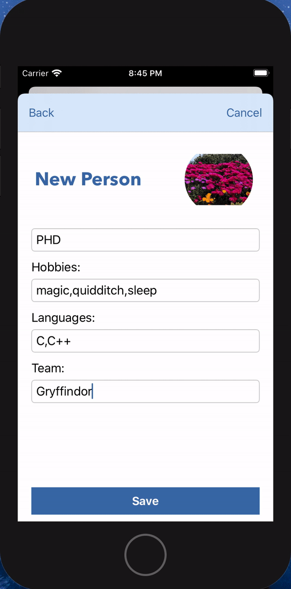
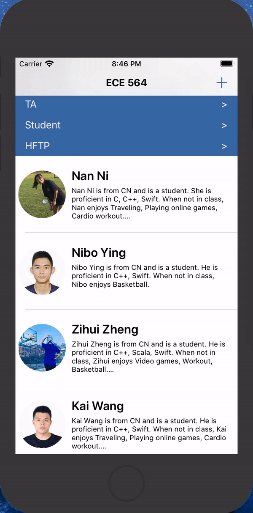
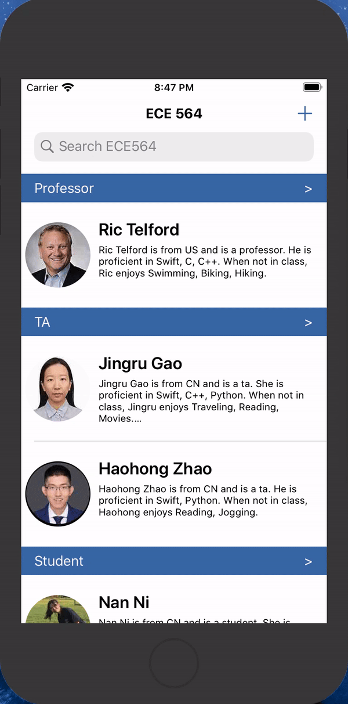
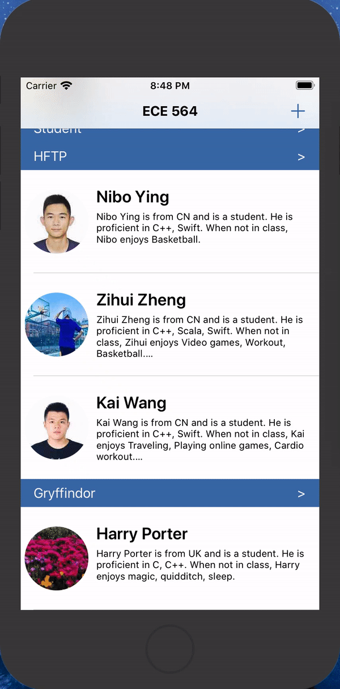
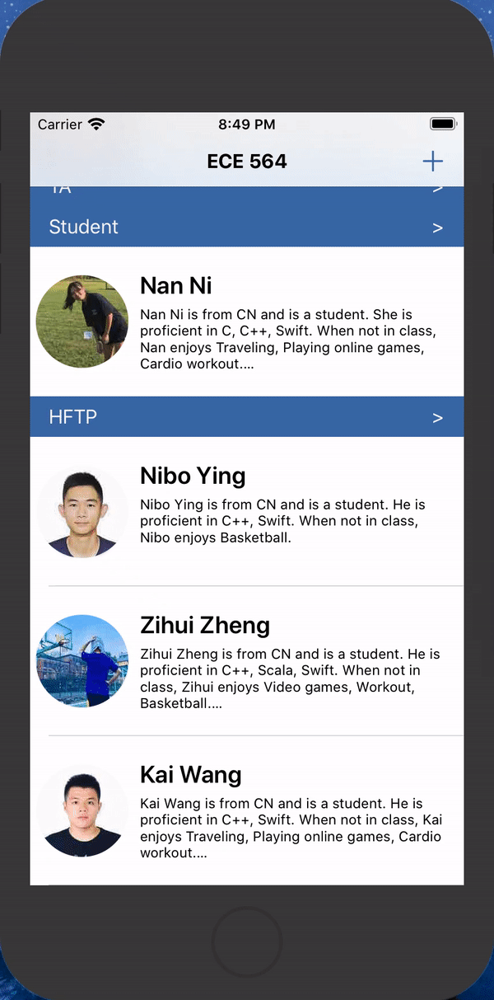

# ECE564 HW5 DukePerson App Test Document

## **Basic Functions**

### **0. Important notes for testing**
- Note1: The project is implement in SQL, the JSONEncoder/JSONDecoder version project is in "homework_5_JSON_verson.zip" file for TAs' testing.
- Note2: The path of database file (or JSON file) is printed in the console, TAs can delete file and return to the original state.
- Note3: The "Professor", "TA" and "Student" section titles are kept，no matter how many people are below the title it.

### **1. JSONEncoder/JSONDecoder support**
- Description: Save and load the array of DukePerson to make it persists from session to session.
- Detail1: The JSONEncoder/JSONDecoder code is commented out in the DukePerson.swift file or in the "JSON_version.zip" file.


### **2. Team support**
- Description: In the Edit mode of the Information View, be able to prompt for Team name for the Person (which is an optional field). If a student does not have a team, leave it in the **"Student"** section. Add my teammates of **"HFTP"** team to default set of table entries that appear when user first bring up the app. On the Table View, sort students under Team Name cell, which is a separator cell that is called **"HFTP"**.
- Step1: Add a new person to a new team. Press **“+”** button on the Navigation Bar, present **Information View** to add a new person to the class.
```
    Click on the "man with question face" to get a photo by album or camera
    First: Harry
    Last: Porter
    Gender: Male
    Role: Student
    From: UK
    Degree: PHD
    Hobbies: magic,quidditch,sleep
    Languages: C,C++
    Team: Gryffindor
```
- Step2: Press **"Save"** button, return back to **"Table View"**, there will be a new team section named **"Gryffindor"** with **"Harry Porter"** under it.
- Step3: Press on **"Nan Ni"** to her **"Information View"**, click on **"Edit"** button, delete the team name **"HFTP"** of **"Nan Ni"**.
- Step4: Press **"Save"** button, return back to **"Table View"**, **"Nan Ni"** will be under the **"Student"** section.

<div align=center>

</div>


### **3. Search support**
- Step1: Click on search bar text field to search. You can search for first name, last name, full name, role, from where, hobby and language.
- Step2: Click on search bar scope button to filter person with specific degree. Click on **"All"** to show all person or click on **"BS"** to show all person with BS degree, and so on.
- Step3: Use both search bar text field and scope button to search person.

<div align=center></div>


### **4. EditingStyle support**
- Step1: Swipe left to delete **"Harry Porter"**, the section header of **"Gryffindor"** will disappear.
- Step2: Swipe left to edit **"Nan Ni"** to her **"Information View"**, click on **"Edit"** button, enter team name **"HFTP"** for **"Nan Ni"**.
- Step3: Press **"Save"** button, return back to **"Table View"**, **"Nan Ni"** will come back to  **"HFTP"** section.

<div align=center>

</div>


### **5. Picture support**
- Description: Add an Image view to Table Cell to show pictures in the Table View. Add an Image view on the Information view for Nan Ni, my teammates, the TAs and the Professor. Add support for picking a picture from the camera roll to the Add view and the Edit view. Add support for the picture property (which is a string) in the ECE564 protocol to DukePerson.  Encode picture from UIImage to base64 string before JSON encoding and decode base64 string to UIImage for displaying after JSON decoding. Make sure the picture is not too big – keep it at 100 dpi and no bigger than 2x2 inches. 
- Detail1: The encoder function named **"base64ToString"** and decoder function of **"base64ToImage"** of image are in the **Extensions.swift** file.
- Detail2: The functions for resizing image are in the **Extensions.swift** file as well named **"resizeImage"** and **"scaleImage"**.
```swift
//MARK: - Convert UIImage into String
extension UIImage {
    func base64ToString() -> String {
        let imageData: Data = self.jpegData(compressionQuality: 0.1)!
        return imageData.base64EncodedString(options: .lineLength64Characters)
    }
}

//MARK: - Convert String into UIImage
extension String {
    func base64ToImage() -> UIImage {
        let dataDecode = Data(base64Encoded: self, options: .ignoreUnknownCharacters)!
        return UIImage(data: dataDecode)!
    }
}

//MARK: - Change UIImage quality & size
extension UIImage {
    func resizeImage(resize: CGSize) -> UIImage {
        UIGraphicsBeginImageContextWithOptions(resize,false,UIScreen.main.scale)
        self.draw(in: CGRect(x: 0, y: 0, width: resize.width, height: resize.height))
        let resizeImage:UIImage = UIGraphicsGetImageFromCurrentImageContext()!
        UIGraphicsEndImageContext()
        return resizeImage
    }
    func scaleImage(scaleSize: CGFloat) -> UIImage {
        let resize = CGSize(width: self.size.width * scaleSize, height: self.size.height * scaleSize)
        return resizeImage(resize: resize)
    }
}
```


## **Additional Functions**

### **1. More complex search**
- Complex search is mentioned in the basic function - **"3. Search support"**.
- Detail1: Search all fields: users can search for first name, last name, full name, role, from where, hobby and language.
- Detail2: Have multiple search fields: user can press scope button to search for degree.

### **2. More options on the “Swipe Left” or “Swipe Right” of a table entry**
- More options on the “Swipe Left” or “Swipe Right” of a table entry is mentioned in the basic function - **"4. EditingStyle support"**.
- Detail1: Swipe left to delete.
- Detail2: Swipe right to edit.

### **3. Implement a different way to save/retrieve in addition to supporting JSONEncoder**
- Implement SQL initialize, insert, update and delete, which is more efficient than JSONEncoder and JSONDecoder.
- Detail1: The status of database will be printed in the console, for example, "xxx is inserted into db successfully."

### **4. Camera support to take pictures from the Add or Edit view**
- Mentioned in the basic function - **"5. Picture support"**.
- Use the right APIs to shrink the picture down to 100 dpi and 2x2 inches or less so they are not too big for JSONEncoder.


