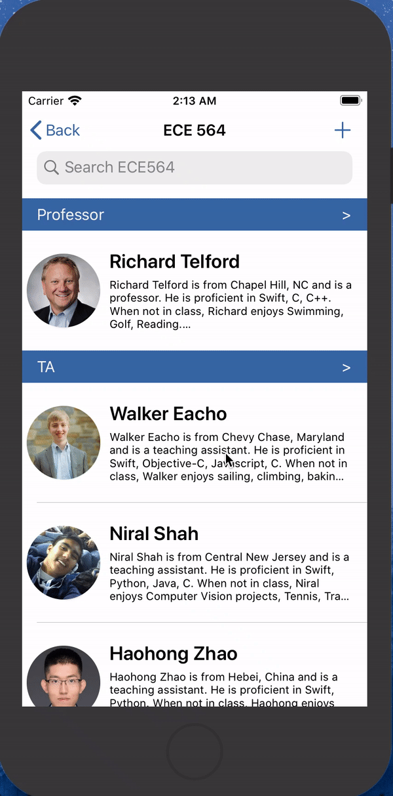

# ECE564 HW6 DukePerson App Test Document

## **Basic Functions**

### **0. Carry forward all functions from HW5**

### **1. Support logon**
- Integrate the Logon Framework into the project.
- Keep the animation of title "ECE564" moving while logon is in progress.
- Pop up alert when authenticating.

### **2. Support communication**
- Use HTTP / REST to send student information to a web server in the ECE 564 JSON Grammar. Also get student information from the server..
- Get1: Pull down list to get the latest information from the server.

- Get2: Get the information from the server once the user logs in.
- Get3: If the "Get" failed, pop up a "Load Failed" alert with the reason.
- Get4: If it is the first time to run app on your machine, and the "Get" after login failed, app will display the default people.
- Post1: If the person being added or edited has the same netid with the authenticated user, his/her information will be send to server once the "Save" button is pressed.
- Post2: If the "Post" failed, pop up a "Post Failed" alert with the reason.

### **3. Support swipe to edit, delete and play animation**
- Swipe left to edit or delete.
- Swipe right to play animation (for anyone that has an "Animation View").

### **4. Highlight in the TableView anyone that has an "Animation" View**
- If the person has animation view, his/her avator will shake for a while.

### **5. Others**
- A clean project in Xcode.  Project Name, bundle name, etc. all be our team name -- “HftpHW6”. 
- Clean, well-structured code with no compiler errors or warnings.
- Comments in the code.
- Nice App Icon.
- Nice looking Table Cells with things like background color, image, subtext line, pictures, fonts, etc.
- Team function support.
- Display and add "email" address on Information View.
- Easy to navigate and use fields on the Edit screen, including good management of dismissing the Keyboard appropriately.
- Looks good / works on an iPhone 8 simulator.
- Support flipping to the Animation Views of all the team members.

